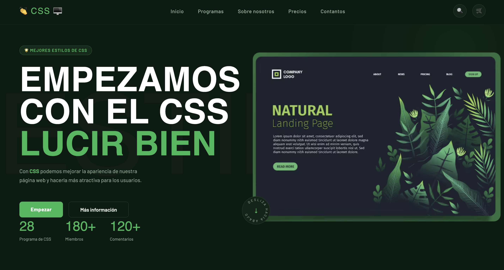

# Laboratorio 3 — CSS

## Objetivo

En este laboratorio deberás aplicar tus conocimientos de **CSS** para diseñar una página web y replicar el diseño presentado en clase.

## Instrucciones

Deberás completar los estilos de la página web proporcionada, tomando como referencia la siguiente imagen:

La imagen de referencia y el archivo **HTML** ya se encuentran incluidos en el proyecto. Tu tarea consiste en desarrollar el archivo **CSS** necesario para que la página tenga una apariencia lo más fiel posible al diseño mostrado en la imagen.

### Entrega

Para completar el laboratorio, deberás:

1. Subir el proyecto a un **repositorio público de GitHub**.
2. Realizar **al menos 2 commits** durante el desarrollo del laboratorio.
3. Publicar la página web utilizando **GitHub Pages** o cualquier otro servicio de hosting.
4. Compartir en el foro de **Classroom**:
   - El enlace al repositorio de GitHub.
   - El enlace a la página web desplegada.

## Criterios de evaluación

Se revisarán los siguientes aspectos:

| Criterio        | Requisito                                                                             |
| --------------- | ------------------------------------------------------------------------------------- |
| **Repositorio** | El proyecto debe estar alojado en un repositorio público de GitHub.                   |
| **Commits**     | El repositorio debe contar con un mínimo de **2 commits** en su historial.            |
| **Diseño**      | La página debe replicar de manera fiel el diseño mostrado en la imagen de referencia. |
| **Despliegue**  | La página debe estar publicada mediante **GitHub Pages** u otro servicio de hosting.  |

### Importante

El objetivo principal del laboratorio es demostrar el dominio de **CSS**, por lo que deberás realizar el diseño utilizando estilos CSS y respetando la estructura HTML proporcionada.
